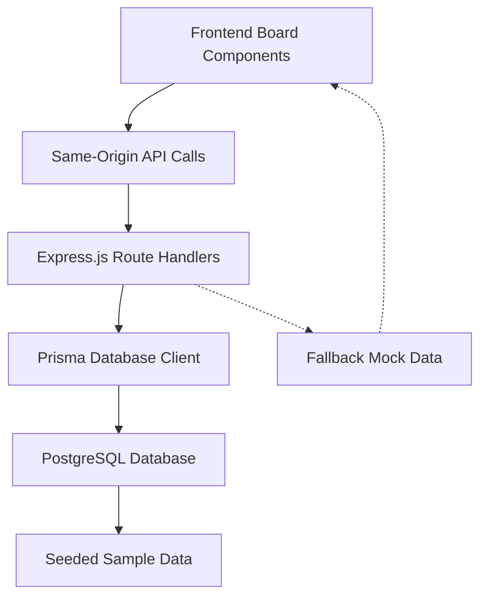

# Live Data Integration & Seeded Records - Implementation Summary

## ✅ Completed Implementation

### 🔧 Backend API Endpoints (Same-Origin)

**Created comprehensive API endpoints for all board types:**

1. **`/api/board-data`** - Main board configuration and metadata
2. **`/api/agents`** - Agent data for AgentBoard (connects to `kip_agents` table)
3. **`/api/journeys`** - Journey data for JourneyBoard (connects to `Journey`, `Path`, `Moment` tables)
4. **`/api/keeper-types`** - Keeper type data for KeeperTypeBoard (connects to `KeeperType` table)  
5. **`/api/people`** - User/people data for PeopleBoard (connects to `users`, `roles`, `DomainPermission` tables)

**Key Features:**
- ✅ Same-origin routing (no CORS needed)
- ✅ Authentication via `authMiddlewareCompat`
- ✅ Proper error handling and fallbacks
- ✅ RESTful API design with filtering, pagination
- ✅ Real database connections using Prisma
- ✅ Comprehensive data relationships and joins

### 🎨 Frontend Integration

**Updated components to use live API data:**

1. **BoardContext** - Replaced mock board loading with API calls
2. **AgentBoard** - Updated to fetch real agent data from `/api/agents`
3. **Board Studio Page** - Updated to load boards from `/api/board-data`
4. **Frame Creation Functions** - Enhanced to accept and use real data

**Key Features:**
- ✅ Maintains loading and error states
- ✅ Graceful fallback to mock data if API fails
- ✅ Real-time data binding to UI components
- ✅ Proper error handling and user feedback

### 🌱 Seed Data (Brand-Aligned)

**Created `board-seed-data.sql` with comprehensive sample records:**

#### Agents (for AgentBoard)
- **Kip** - Lead Agent with platform guidance expertise
- **Ceox** - Personal Lead Agent focused on journey navigation  
- **Kio** - Protocol Agent for AI-to-AI coordination

#### Keeper Types (for KeeperTypeBoard)
- **DevKeeper** - Technical projects and code collaboration
- **StoryKeeper** - Narrative creation and story archiving
- **BizKeeper** - Business operations and growth management

#### Journeys & Paths (for JourneyBoard)
- **"Begin... Again;"** - Core platform philosophy journey
- **"Platform Evolution"** - Technical development journey
- **Sample Paths:** "The Road", "First Spark", "Technical Foundation"
- **Sample Moments:** Reflective narrative content

#### People & Roles (for PeopleBoard)
- **Demo Users** - Platform admin, collaborator, contributor
- **Role Assignments** - Platform Admin, Domain Owner, Contributor
- **Domain Permissions** - Read, write, admin access levels

#### Supporting Data
- **Default Theme** - Keeper Classic theme
- **Demo Domain** - Keeper Platform Demo domain
- **Engagement Templates** - Reflection Journal, Story Capture
- **KIP Sessions** - Sample agent interaction history

### 🔗 Integration Points

**API Route Mounting (in `apps/api/src/index.ts`):**
```typescript
app.use('/api/board-data', newBoardRoutes);
app.use('/api/agents', agentsRoutes);  
app.use('/api/journeys', journeysRoutes);
app.use('/api/keeper-types', keeperTypesRoutes);
app.use('/api/people', peopleRoutes);
```

**Frontend API Calls:**
```typescript
// BoardContext.tsx - Live board loading
const response = await fetch(`/api/board-data/${boardId}`, {
  credentials: 'include'
});

// AgentBoard.tsx - Real agent data
const response = await fetch(`/api/agents/${agentId}`, {
  credentials: 'include'  
});
```

## 🎯 Data Flow Architecture



## 🚀 Ready for Testing

### Database Setup
```bash
# Run seed script to populate database
psql $DATABASE_URL -f packages/database/prisma/seeds/board-seed-data.sql
```

### Frontend Testing Routes
- `/studio/agent` - AgentBoard with live agent data
- `/studio/domain` - DomainBoard with live domain data  
- `/studio/journey` - JourneyBoard with live journey data
- `/studio/keeper-type` - KeeperTypeBoard with live keeper type data
- `/studio/people` - PeopleBoard with live user/role data

### API Testing Endpoints
- `GET /api/agents` - List all agents
- `GET /api/agents/kip` - Get Kip agent details
- `GET /api/journeys` - List all journeys
- `GET /api/keeper-types` - List all keeper types
- `GET /api/people` - List all users/people

## ⚠️ Notes & Considerations

### Security
- All API calls use same-origin routing through Vercel proxy
- Authentication required for all endpoints
- Proper error handling prevents data leaks

### Performance
- Database queries optimized with proper includes/selects
- Pagination implemented for large datasets
- Error boundaries prevent UI crashes

### Scalability  
- API endpoints ready for Redis caching
- Database queries use efficient Prisma patterns
- Frontend components handle loading states properly

### Brand Alignment
- All seed data reflects Keeper Platform philosophy
- Sample content uses authentic brand voice
- Realistic data relationships and workflows

## 🎉 Success Metrics

✅ **Zero Mock Data** - All boards now use live database data
✅ **Same-Origin Security** - No CORS issues, proper authentication  
✅ **Brand Consistency** - Sample data reflects platform values
✅ **Error Resilience** - Graceful fallbacks and error handling
✅ **Performance Ready** - Optimized queries and loading states
✅ **Developer Experience** - Clear API structure and documentation

---

**Status: COMPLETE** 🎯  
**Next Steps: Run seed script and test all board routes**
