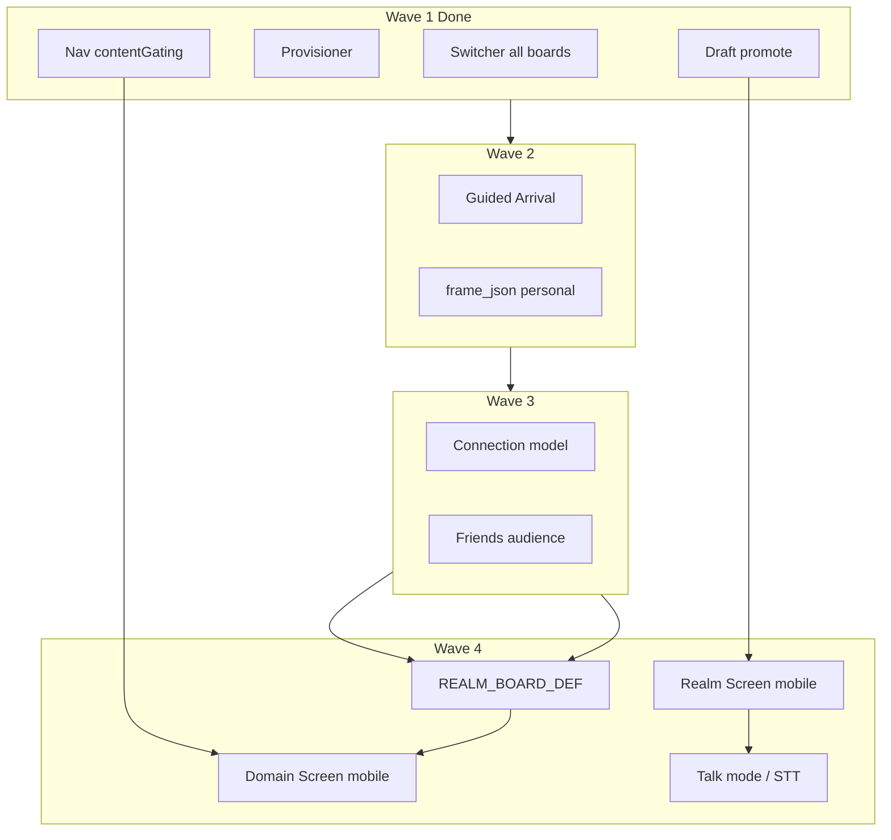

# Realm Development Plan

**Keeper Platform · KE3P**  
**Audience:** Chuck Livecchi · Kip · Cloud · Cursor agents  
**Last updated:** June 30, 2026

> **One sentence:** Four boards are where you work on a domain. Realm is where you live in it — primarily on mobile and tablet; desktop reserved for platform administration and development.

---

## Experience split (locked)

| Surface | Primary use | Boards / routes |
|---------|-------------|-----------------|
| **Mobile + tablet** | Being in your realm — capture, dialog, presence | Realm Screen · in-realm Domain Screen · public Present |
| **Desktop** | Building, thinking, shaping, managing | IDE · Agent · Design · Domain (`?board=*`) |
| **Wearables** | Listen → text → composer (same pipeline as mobile talk mode) | Feeds Realm Screen composer; no separate app shell in v1 |

**Grandma test applies hardest on mobile Realm** — no platform jargon on the primary capture path.

---

## Two mobile surfaces (Chuck model)

Realm on mobile is **not one screen** — it is two surfaces sharing the same backend, engagement pipeline, and Universal Board semantics.

### 1. Realm Screen (primary mobile entry)

**Purpose:** Moment capture and cross-domain interaction — the default authenticated mobile home.

| Element | Behavior |
|---------|----------|
| **Domain list** | Same data as Domain Switcher / picker (`GET /api/domains/my`) — your realms at a glance |
| **Composer** | Talk-first: easy audio / talk mode; text fallback |
| **Primary action** | Capture a moment or start domain interaction without entering full three-panel chrome |
| **Navigation** | Tap a domain → in-realm Domain Screen |

This is **not** the Domain Board admin surface. It is the **hub** — list + voice/text composer.

**Code direction:** New shell route or mobile root (e.g. `/realms` or mobile default before `/d/:slug`). Reuse `fetchDomainSwitcherEntries` / `DomainSwitcherOverlay` data layer; do not duplicate domain APIs.

### 2. Domain Screen (in-realm)

**Purpose:** Dialog · conversation · Chronicle for one domain — same architecture as Universal Board, different layout.

| Desktop | Mobile / tablet |
|---------|-----------------|
| Nav · Dialog · Chronicle (three panels) | Tab or staged layout (existing `UniversalMobileShell` patterns) |
| `?board=realm` (future) | Same `UniversalBoardDef` + `UniversalBoardContext`; mobile shell swaps layout |
| Full Nav sections | Self-organizing nav (`navMode: "contentGated"`) when on Realm board |

**Existing foundation:** `apps/web/src/mobile/` — `UniversalMobileShell`, staged Kip dialog (`mobile-staged`), Keep/Moment/Journeys/World tabs, PWA. Today this wraps **Domain Board** only. Phase 4 mobile extends it for **Realm board** and wires Realm Screen as entry.

**Principle:** Nav triggers, Chronicle renders — unchanged. Mobile uses overlays/tabs instead of side panels.

---

## Wearables (voice → text)

| Layer | v1 approach | Later |
|-------|-------------|-------|
| **Input** | Device STT → composer text (Web Speech API on supported browsers; native bridge for watch OS) | Wake word, continuous listen |
| **Output** | Text + optional TTS on response (ElevenLabs already in stack) | Earbud-optimized replies |
| **Routing** | Same Kip / lead-agent dialog pipeline as mobile talk mode | Domain-scoped session handoff |
| **Capture** | Voice → moment draft or dialog message; user confirms before keep | Auto-keep with undo |

Wearables do **not** get a separate data model — they are an input modality on Realm Screen composer.

---

## Phase map (updated)

### Phase 1 — Foundation ✅ (Wave 1 complete in tree)

| Step | Deliverable | Status |
|------|-------------|--------|
| 1.1 | DomainSwitcher on all member boards | Done |
| 1.2 | Domain creation + provisioner on all create paths | Done |
| 1.3 | Engagement templates on Board | **Done** |
| 1.4 | Personal `frame_json` (stop KE3P bleed) | **Done** |

**Mobile note:** Phase 1 mobile work stays on Domain Board shell — no Realm Screen yet.

---

### Phase 2 — Arrival

| Step | Deliverable | Status | Mobile tie-in |
|------|-------------|--------|---------------|
| 2.1 | Guided Arrival — lead agent on new domain | **Done** | First Dialog on mobile Domain Screen after provision |
| 2.2a | Draft accumulation from arrival | Partial (composer hint; auto draft deferred) | Chronicle + mobile Kip tab |
| 2.2b | Draft point → Journey/Moment promote | **Done** | Promote from mobile when Journey selected |
| 2.3 | Lead agent graduation | Partial (arrival uses lead agent; full graduation UX deferred) | Realm voice = lead agent, not platform Kip |

---

### Phase 3 — Connection

| Step | Deliverable | Mobile tie-in |
|------|-------------|---------------|
| 3.1 | Connection model + invite-by-name | Friends see curated subset on mobile Domain Screen |
| 3.2 | Friends audience layer | Extend `resolveAudience` beyond guest/keeper/admin |
| 3.3 | Present / public hardening | Public mobile = read-only Cover/Present |
| 3.4 | livecchi.us DNS | Ops — Chuck |

**Gate:** Do not ship `?board=realm` until Phase 3 audience layers work.

---

### Phase 4 — Realm Board (desktop def + mobile surfaces)

#### 4A — Realm Board definition (desktop-capable, mobile-first product)

| Step | Deliverable |
|------|-------------|
| 4A.1 | `REALM_BOARD_DEF` — `navMode: "contentGated"`, Cover-first Chronicle, lead-agent solo dialog |
| 4A.2 | Register `?board=realm` in registry + top bar (desktop admin path) |
| 4A.3 | Three views: Interior / Friends / Public |
| 4A.4 | Chatter + Connections nav sections (when content exists) |
| 4A.5 | No Cloud on Realm interior |

#### 4B — Mobile Realm Screen (new — primary mobile home)

| Step | Deliverable |
|------|-------------|
| 4B.1 | **Realm Screen** — domain list + composer shell (picker parity) |
| 4B.2 | **Talk mode** — push-to-talk or toggle; STT → composer; send to active/default domain |
| 4B.3 | **Quick capture** — voice/text → moment or dialog without full board chrome |
| 4B.4 | Default mobile auth landing → Realm Screen (not `?board=domain` three-panel) |
| 4B.5 | Tablet: Realm Screen + optional split Domain Screen (list + dialog side-by-side) |

#### 4C — Mobile Domain Screen (in-realm)

| Step | Deliverable |
|------|-------------|
| 4C.1 | `UniversalMobileShell` (or successor) driven by `REALM_BOARD_DEF` when `?board=realm` |
| 4C.2 | Staged Dialog + Chronicle drawer/sheet (extend `mobile-staged` + `MobileKipChronicleView`) |
| 4C.3 | Self-organizing nav as tab sections or single scroll (only sections with content) |
| 4C.4 | `?surface=desktop` override for admin/dev on mobile browser |

#### 4D — Wearables

| Step | Deliverable |
|------|-------------|
| 4D.1 | STT hook (`useTalkMode`) shared by Realm Screen + Kip mobile |
| 4D.2 | Composer accepts injected transcript; confirm before send |
| 4D.3 | PWA / deep link from watch companion (platform-specific — document, defer native) |

---

## Architecture constraints (unchanged)

- **Universal Board constitution** — def is the board; no board-specific panel overrides.
- **Singular UI** — Realm member work on `?board=realm`, not legacy `?frame=*`.
- **Nav triggers, Chronicle renders** — mobile uses sheets/overlays, same engagement pipeline.
- **Desktop IDE/Agent/Design/Domain** — remain desktop-first; mobile may link out with `?surface=desktop` for admin tasks.

---

## Wave status (June 30, 2026)

| Wave | Scope | Status |
|------|-------|--------|
| **Wave 1** | 1.1 switcher · 1.2 provisioner · nav contentGating · 2.2b promote | **Complete** (uncommitted) |
| **Wave 2** | 2.1 Guided Arrival · 1.4 frame_json · 1.3 templates | **Complete** (uncommitted) |
| **Wave 3** | 3.1–3.3 Connection + Friends + Present | After Wave 2 |
| **Wave 4** | 4A Realm def · 4B Realm Screen · 4C mobile Domain · 4D talk mode | After Phase 3 gate |

---

## Dependencies diagram

---

## Clear next steps (priority order)

### Immediate (you or agents — no product decisions needed)

1. **Commit + deploy Wave 1** — switcher, provisioner fixes, nav gating, draft promote. Run `pnpm run smoke`, then commit.
2. **Provision personal realm** — visit `/d/chuck-livecchi?board=domain` as owner (auto-provision) or `POST /api/domains/:id/provision`.
3. **Manual verify promote on mobile** — accept `journey_spec` point → select Journey → Promote → confirm Path/Moments in Nav (Domain Screen path).

### Wave 2 (next agent batch)

4. **Guided Arrival (2.1)** — first-visit detection + arrival session on newly provisioned domain.
5. **Personal frame_json (1.4)** — seed `chuck-livecchi` wordmark/tagline; stop platform branding bleed.
6. **Engagement templates (1.3)** — Nav `+` → Chronicle Acts for Journey/Path/Moment on Domain Board (mobile parity automatic).

### Wave 3 (Connection — blocks Realm board)

7. **Connection Prisma model + API (3.1)** — distinct from `DomainInvitation` if Friends ≠ domain member.
8. **Friends audience (3.2)** — extend `resolveAudience`; content visibility flags.
9. **Present mobile read path (3.3)** — guest/public on narrow viewport.

### Wave 4 (Realm — after Wave 3 gate)

10. **`REALM_BOARD_DEF` (4A)** — contentGated nav, Cover Chronicle, lead agent.
11. **Realm Screen prototype (4B)** — domain list + composer; mobile default route.
12. **Talk mode v1 (4D.1–4D.2)** — STT → composer on Realm Screen (unblocks wearables).
13. **Mobile Domain Screen for realm (4C)** — extend `UniversalMobileShell` for `?board=realm` staged Dialog + Chronicle.

### Explicitly defer

- Native watch apps — document STT contract; ship web talk mode first.
- Desktop Realm as primary — desktop gets Realm board for admin/preview; product home is mobile Realm Screen.
- `?board=realm` until Connection layer passes smoke.

---

## References

- `docs/week-in-review-june-2026.md` — Wave 1 detail, Realm vision
- `apps/web/src/mobile/README.md` — current Universal Mobile shell (Domain Board)
- `apps/web/src/v0/boards/UniversalBoardDefinition.ts` — board def pattern
- `apps/web/src/v0/boards/navContentGating.ts` — self-organizing nav infrastructure
- `AGENTS.md` — agent index (translate Phase 2/3 engineering names vs this plan)

---

*Maintained by: Cursor · Review: Chuck*
